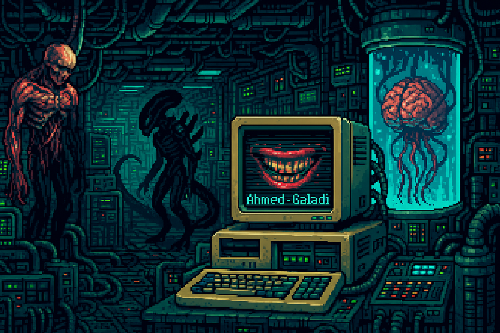

<!-- Pixel Art Background (acts like a banner) -->

  

  

<h1 align="center">Hi 👋, I'm Ahmed Galadi</h1>
<h3 align="center">Hey there! I'm a curious soul hailing from Morocco and currently navigating the world of code at 1337 Coding School. My passion lies in the depths of low-level programming, where I thrive on creating clean, efficient systems that make the digital world run smoother. Whether I'm fine-tuning algorithms or building sleek, minimalist C programs, I aim to craft code that’s not just functional, but a true work of art. When I'm not diving into system-level coding, I'm also exploring the vast world of web development, where the front-end meets the back-end to create seamless user experiences.</h3>

  

<!-- GitHub Trophies with dark theme -->

  

- 🔭 I’m currently working on [Ash of the Self](https://github.com/Ahmed-Galadi/ash_of_the_self)  
- 🌱 I’m currently learning **SFML - https://www.sfml-dev.org/**  
- 💬 Ask me about **C, C++, JavaScript**  
- 📫 How to reach me: **galadiahmed99@gmail.com**

### Connect with me:

  
  

### Languages and Tools:

  
  
  
  
  
  
  
  
  
  
  
  
  

<!-- GitHub Stats with dark theme -->

  

  &nbsp;

  

